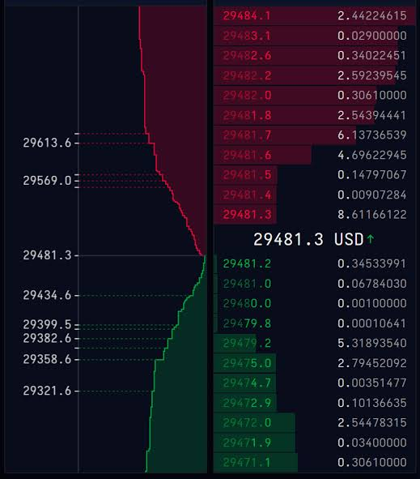

I had a desire to write a highload project in C++ with some application in high-frequency trading, finance, and related fields. My goal is not exactly to dive into the domain of a problem, but rather to carry out millions of operations per second and make a *solid* C++ project (with tests, scripts, and benchmarks).

I came to the idea of writing an **order book** - a structure that keeps track of all the buy and sell orders (*bids* and *asks*, respectively). It can be found on stock exchanges' UIs. For example, buy orders on the left (marked green) and sell orders on the right (marked red).

An image of an order book I found on the Internet:


I began thinking about the implementation part of the order book. The first assumption I've made is that **prices are not floating-point numbers**, they are just **integers**. This way I can avoid problems with math and special handling of numbers:
```
using Price = unsigned int;
```

How am I going to store bids and asks efficiently, so that it doesn't consume much memory, doesn't degrade performance, and still provides a solution to the problem? I came to the idea of using an array, where **each index of this array is a price**.

A couple of advantages of having an array here:

1) As I understand it, most operations are done at the intersection of buy and sell prices. In an array, these cells are going to be near each other. Such a placement in memory is *cache-friendly*.

2) *O(1)* access complexity.

Even though the array seems good here in a *performance* sense, what about memory? Will it be reallocated every time a new, higher price arrives? I thought it would be a problem, so I made a second assumption here - **the price is going to be limited at the top by some value**. I think it's a huge oversimplification on my part, but again, I'm not trying to make a real-world-like order book that can be used in real projects, at least for now. Maybe in the future I'm going to implement this part "correctly".
```
constexpr std::size_t MAX_PRICE_VALUE = 9999U, MIN_PRICE_VALUE = 1U;
```

So, the array is going to be *preallocated* and *stay the same size* during the whole execution of the program. But what does this array store exactly? How should I store the orders with the same price?

The only operations I'll be doing with the orders at a specific price are *adding and removing*. And *the order of insertion and removal is important*, because if I have a bunch of bids and an ask comes in, then the oldest bid has to be processed first. Also, I don't need to access a random order at a price; it's just not required for the problem I'm trying to solve.

I think a logical solution for this is a **queue of orders**. If a new order arrives, then it's either inserted at the end of the queue, or processed from the start (the oldest ones). I have doubts about such a choice though: the queue is *not cache-friendly* like an array, so I guess it can affect performance negatively.
```
  /**
  * @brief Array of prices that holds bids and asks.
  * 
  */
  std::array<std::queue<Order>, MAX_PRICE_VALUE + 1> prices;
```

It's also a vital part to take care of executing orders if they match - when a bid and an ask have the same price. For such cases I added a **bids start index** and an **asks start index**. Basically, these variables are *the prices of the highest bid and the lowest ask*. I was thinking about using iterators instead of plain numbers, but in my case I need the exact price of the top-most bid and the bottom-most ask. Iterators just don't fit well for handling the intersection of bid and ask prices.
```
  /**
   * @brief Take care of top bids price and bottom asks price.
   * 
   */
  Price bidsStart{MIN_PRICE_VALUE}, asksStart{MAX_PRICE_VALUE};
```

About the interface that the order book has to provide. At first, I thought of just two functions:

1) **apply the order**.

2) **print out the whole order book**.

During the process of implementing these functions, I added two more: getting **the total number of present orders** and getting **the orders at a specific price**. I don't think they are going to be used in the project as I see it, but nonetheless, I added them for testing and possible future extensions.

Here is what **class OrderBook** looks like:
```
class OrderBook {
 public:
  std::expected<void, OrderBookError> applyOrder(const InputOrder&);

  std::size_t getTotalOrdersCount() const;
  std::expected<std::vector<Order>, OrderBookError> getOrdersAtPrice(
      Price) const;

  void dump(std::ostream& os) const;

 private:
  void addOrderAtPrice(const Order&, Price);

  void executeBid(const Order&, Price);
  void executeAsk(const Order&, Price);

  void advanceAsksBoundary();
  void retreatBidsBoundary();

 private:
  /**
  * @brief Array of prices that holds bids and asks.
  * 
  */
  std::array<std::queue<Order>, MAX_PRICE_VALUE + 1> prices;

  /**
   * @brief Take care of top bids price and bottom asks price.
   * 
   */
  Price bidsStart{MIN_PRICE_VALUE}, asksStart{MAX_PRICE_VALUE};
};
```

I'll get to the implementations in the next part of this series.